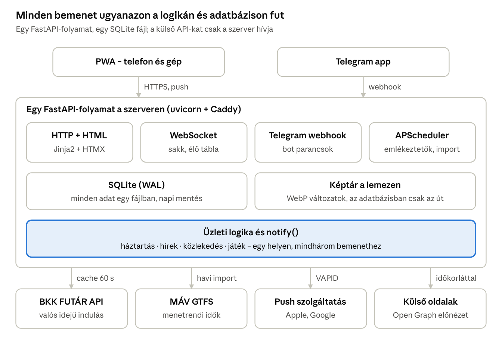

# NarciszApp – technikai javaslat

Oct 2, 2026 · @Thty

Javaslat a *nárcisz utcai lakás házi tamagochi* koncepcióban felsorolt funkciók technikai kivitelezésére.

## Összefoglaló

A javaslat: **egy telepíthető PWA egyetlen Python backend mögött, a Telegram bottal mint második bemeneti úton**. Mind a négy modul (háztartás, közlekedés, hírek, játék) ugyanabban az alkalmazásban és adatbázisban él, külön mobilalkalmazás nélkül. 2–5 fő mellett ez egy darab kis szerveren elfut, havi 5 euró körüli költséggel.

Három döntés, amin a többi múlik:

1. **PWA, nem natív app.** Egy kódbázis telefonra és gépre, telepíthető ikonnal, app store nélkül. Push értesítés Androidon és desktopon teljes, iPhone-on a kezdőképernyőre tett alkalmazásban működik.
2. **Egy szerver, egy adatbázis, egy ütemező.** FastAPI + SQLite + APScheduler egy konténerben; a szerver kiszolgálja a weboldalt, a Telegram webhookot, a WebSocketet és az időzített emlékeztetőket is. Mikroszolgáltatás, külön frontend-projekt és külön ütemező-infrastruktúra ezen a méreten csak többletmunka.
3. **A Telegram bot nem külön rendszer.** Ugyanazokat a függvényeket hívja, mint a weboldal, így egy Telegramban beküldött link vagy bevásárlólista-tétel azonnal megjelenik a felületen is.

A szerveroldali renderelés (HTML a szerverről, kevés JavaScript) közvetlenül a koncepció adatforgalom- és sebességigényét szolgálja: egy lista- vagy naptároldal néhány kB-ban átmegy, mobilhálózaton is.

## Platform: telepíthető PWA

**Javaslat: PWA**, azaz böngészőből telepíthető webalkalmazás. A koncepcióban nincs olyan funkció, amihez natív app kellene (nincs háttérbeli helymeghatározás, Bluetooth, kamera-folyam vagy widget), viszont van két követelmény – telefon és gép egyszerre, és push értesítés – amit a PWA mindkettőt tudja.

| Megoldás | Telefon + gép | Push értesítés | Közzététel | Többletmunka |
| --- | --- | --- | --- | --- |
| **PWA (javasolt)** | egy kódbázis, böngészőből telepítve | igen; iOS-en a kezdőképernyőre tett appban | nincs, URL-lel megy | — |
| Natív (React Native, Flutter) | külön mobil és külön web | igen, teljes | App Store és Play Store, Apple-nél évi \~99 USD fejlesztői díj | második kódbázis, store-os kiadási kör |
| Sima weboldal (nem telepíthető) | egy kódbázis | iOS-en nincs | nincs | — |

### Amit a PWA-nál tudni kell

- **iOS-en a telepítés nem opcionális.** Böngészőfülön nyitott oldal nem kaphat push értesítést; a felhasználónak a *Megosztás → Add to Home Screen* úton kell feltenniá az appot. Ez iOS 16.4 óta (2023. március) működik, és kell hozzá egy helyes `display: standalone` beállítású web app manifest.
- **Az engedélykérést felhasználói kattintásnak kell kiváltania.** Nem lehet oldalbetöltéskor felugrasztani; egy „Értesítések bekapcsolása” gomb kell a beállítások közé. Mivel ez 2 fő, ez egyszeri, 1 perces beavatás.
- **A feliratkozás elveszhet** hosszabb inaktivitás után iPhone-on. Ezért az app minden indításkor ellenőrzi a feliratkozást, és ha eltűnt, csendben újra bejegyzi. A fontos emlékeztetőknek a Telegram a tartalék útja (lásd „Értesítések”).
- **A PWA nem nyit automatikusan újra**, így a „játékos következik” típusú jelzés is push-on érkezik, nem helyi időzítőn.

Gépen (Chrome, Edge) és Androidon ugyanez működik telepítés nélkül is, tehát a szűk keresztmetszet mindig az iPhone.

Forrás az iOS-feltételekről: [Pushpad – iOS special requirements for web push](https://pushpad.xyz/blog/ios-special-requirements-for-web-push-notifications), [OneSignal – Mobile Web Push for iOS](https://documentation.onesignal.com/docs/ios-web-push).

## Architektúra és technológiai stack

Egy FastAPI-alkalmazás szolgálja ki a weboldalt, a Telegram botot, a játék WebSocketjét és az időzített feladatokat, egy SQLite adatbázissal. A stack-javaslat fő szempontja, hogy Pythonban van (ez az eddigi munkák nyelve), és hogy a kliensre a lehető legkevesebb kód jusson.

| Terület | Javaslat | Alternatíva | Miért a javaslat |
| --- | --- | --- | --- |
| Backend | Python 3.12 + FastAPI + uvicorn | Node.js (SvelteKit), Django | aszinkron HTTP, WebSocket és webhook egy keretben; a sakk- és bot-könyvtárak itt a legjobbak |
| Felület | szerveroldali HTML (Jinja2) + HTMX, kevés vanilla JS | React vagy Svelte SPA | nincs külön build-lánc, kisebb leteltöltés, 2 főnek kevesebb mozgó alkatrész |
| Adatbázis | SQLite WAL módban + SQLAlchemy + Alembic | PostgreSQL | 2–5 főnél egy fájl, nincs külön szolgáltatás; később átállítható |
| Valós idejű kapcsolat | WebSocket (FastAPI natívan) | SSE, polling | a sakk kétirányú, a többi modulhoz nem is kell |
| Ütemezés | APScheduler ugyanabban a folyamatban | cron + Celery/Redis | nincs külön broker és worker, amit üzemeltetni kell |
| Értesítés | `pywebpush` + VAPID kulcspár | Firebase (FCM), OneSignal | nincs harmadik fél és nincs fiókkötöttség |
| Telegram | `python-telegram-bot`, webhook módban | aiogram, polling | webhooknál nincs folyamatos kérdezgetés |
| Üzemeltetés | 1 kis VPS, Docker Compose, Caddy | Fly.io, Railway, Render | fix díj, és az always-on ütemező + WebSocket miatt egyszerűbb mint a serverless |
| Hitelesítés | meghívásos fiók, sütis session | Google OAuth | 2–5 zárt fióknál nem kell külső szolgáltató |

A Caddy adja az automatikus HTTPS-t (ez a PWA és a push előfeltétele), és egy GitHub Actions munkamenet futtatja a teszteket, majd értesíti a szervert az új verzióról.

A böngésző és a Telegram ugyanazt az üzleti logikát hívja, és a külső szolgáltatások felé csak a szerver fordul: így az API-kulcsok nem kerülnek ki a böngészőbe, és a hívásszám nem a felhasználók számával nő.

## Háztartás modul

A modul három dologból áll: egy közös bevásárlólista, egy ismétlődő feladatokat kezelő naptár, és a kettőre épülő pontozás. A kulcsdöntés az ismétlődő feladatok tárolása.

**Bevásárlólista.** Egy tábla (tétel, mennyiség, ki tette be, mikor, állapot), a felületen egy lista pipáló gombbal. Minden kattintás egy kis POST, a válasz csak az érintett sor HTML-je – nem tölt újra az oldal. Telegramból `/bolt kenyer 2` formában is bekerülhet tétel. A megvett tételek nem törlődnek, csak átkerülnek az előzmények közé: ebből jön később a „gyakori tételek” gyorslista.

- splitwise funkcióit építsük bele leegyszerűsítve, csak ami két személynek szükséges a budget ellenőrizhetősége miatt

**Ismétlődő feladatok – RRULE, nem saját logika.** A feladat definíciója egy iCalendar ismétlődési szabály (`RRULE`, RFC 5545), amit a `python-dateutil` értelmez. Példa: a fürdő minden második szombaton, a szűrőcsere háromhavonta. Az ütemező éjjel legenerálja a következő 30 nap esedékes példányait egy külön táblába, és a naptár ezeket olvassa. Ennek három haszna van: a naptárnézet egy egyszerű lekérdezés, a pipálás egy konkrét napra vonatkozik (nem a szabályra), és az elmaradt feladat látható marad.

**Érdemes rátenni egy .ics feedet.** Egy olvasásra szóló, tokennel védett naptár-URL (`webcal://`), amit a telefon saját naptára feliratkozással beköt. Így a feladatok a rendszernaptárban is megjelennek és ott is adnak emlékeztetőt, a push tól függetlenül. Ez néhány tucat sor kód, és pont az iOS-es push-gyengéket fedi le.

- opcionális funkció de fontos hogy google calendarba vagy rendszernaptárba is beköthető legyen

**Gamification.** A legkisebb működő változat: minden feladatnak van egy pontértéke (nehezebb feladat több pont), elvégzéskor a pont a pipáló személyhez kerül, és a felületen egy heti állás látszik két sávval. Erre épül két egyszerű motivációs elem: **széria** (hány hete nincs elmaradt feladat) és **heti cél** (pl. 20 pont). Jelvényeket és szinteket csak akkor érdemes hozzáadni, ha a pontozás már egy hónapot kibírt élesben – különben csak adatmodellt hizlal.

- jutalom réteget adjunk hozzá a pontozáshoz: meghatározhatóan hetente/kéthetente/havonta... a sört, bevásárlást az fizeti aki elmaradt a feladattal és /vagy két plusz lépést kap a sakk meccsen / ő választhatja ki a hét tematikáját, a hét hírét

## Közlekedés modul

Nem utazástervező kell, hanem egy „ktöbb-indulás” tábla: a lakás körüli néhány megálló és a rendszeresen használt vonatviszonylat következő indulásai. Ez a megkötés nagyon sokat egyszerűsít: néhány fix lekérdezés, nem útvonalkereső motor.

- Nárcisz utca 2b 1121 körüli bkk megállók,  MÁV nagy pályaudvarok technikai információi (extrém menetrendi átalakítások, késések, leterelések, vagy vonal szünetetetésekről kell hír. menetrendi információk nem kellenek ha nincsen valós idejű adat (késésről is jó ha van)) 

| Forrás | Mit ad | Hogyan használjuk | Kockázat |
| --- | --- | --- | --- |
| **BKK FUTÁR API** ([opendata.bkk.hu](https://opendata.bkk.hu)) | valós idejű indulások megállónként, járműpozíció, menetrend | ingyenes API-kulcs regisztráció után; a szerver kérdez megállónként, 60 s cache-sel | kulcshoz kötött, kvótás; a kulcs csak a szerveren lehet |
| **MÁV GTFS menetrend** ([igénybejelentő](https://www.mavcsoport.hu/gtfs-igenybejelento)) | teljes menetrendi adatbázis, díjmentesen, regisztrációval | havonta letöltve és beimportálva; ebből jön a menetrendi idő | nincs benne késés, csak terv |
| MÁV valós idejű (nem hivatalos) | késés, vonatpozíció | *best effort*: ha válaszol, kiegészíti a menetrendi időt | nincs hivatalos támogatás, bármikor megszűnhet |

**A MÁV-ra nem építhető valós idejű funkció garanciával.** A MÁV GTFS-RT-t nem ad ki, így késésadat csak nem hivatalos végpontokról (vonatinfo, EMMA/ELVIRA) szerezhető; a közösségi kliensek is ezt teszik, nyíltan jelezve, hogy engedélyt kell kérni az éles használathoz ([juliuste/mav](https://github.com/juliuste/mav)). Javaslat: a felület mindig a menetrendi időt mutatja, és a késést csak **kiegészítésként**, forrásmegjelöléssel és időbélyeggel. Ha a végpont elhal, a modul nem törik el, csak szegényebb lesz.

**Cache és adatforgalom.** A kliens soha nem hívja közvetlenül a szolgáltatókat, mindig a saját szervert. A szerver megállónként tartja a legutóbbi választ 30–60 másodpercig, és csak akkor frissít, ha valaki az elmúlt 10 percben használta az appot. Így a hívásszám nem a felhasználók számával nő, és éjjel nulla. Hiba esetén az utolsó sikerült válasz látszik, „3 perccel ezelőtti adat” megjegyzéssel – ez jobb, mint egy üres tábla.

- bkk menetrendek csak akkor használhatóak ha percre pontosan működik (buszok 1-5 percenként jönnek akkor nem akadhat be a frissítés). Az app megnyitásakor frissüljön és az app 30 perce inaktív  akkor leállhat. A frissítés gyorsasága fontos szempont!

A fenti linkek a regisztrációs oldalakra mutatnak; a pontos végpontokat, kvótákat és felhasználási feltételeket a kulcs igénylésekor kell véglegesíteni.

## Hírek és tartalmak modul

Egyetlen posztfolyam, háromféle poszttal: link, kép + szöveg, vagy csak szöveg. Technikailag egy tábla, típus mezővel és címkékkel (`groteszk`, `tech`, `a hét híre`) – a „a hét vezető híre” nem külön funkció, hanem egy kiemelő jelölés.

**URL-előnézet.** Amikor valaki linket posztol, a szerver letölti az oldalt, kiolvassa az Open Graph metaadatokat (`og:title`, `og:description`, `og:image`), a képet pedig **letölti és átméretezi** saját tárba (Pillow, WebP, kb. 800 px). Így a lista akkor is gyorsan és egységesen tölt, ha a forrásoldal lassan válaszol vagy később eltünteti a képet. YouTube és Vimeo esetén az oEmbed adja a címet és a borítóképet; a lejátszó csak kattintásra tölt be, nem automatikus iframe-ként.

**A linkbetöltőt védeni kell.** Bármilyen URL bekerülhet (főleg Telegramon), ezért a letöltő csak http/https címet nyit meg, DNS-feloldás után elutasítja a privát IP-sávokat, 5 másodperc után időtúlliépik, legfeljebb 2 MB-ot tölt le, és maximum két átirányítást követ. Ez néhány sor, de nélküle a szerver bármilyen belső címet lekérdezhetővé tesz.

**Tárolás.** A képek fájlként a lemezen, az adatbázisban csak az útvonal és a méret. 2–5 fő és napi néhány poszt mellett ez évekig néhány száz MB; külső tárhely (pl. Cloudflare R2) csak akkor kell, ha a VPS lemeze kezd betelni.

**Hírgyűjtés félautomatán.** Ha nem akarjátok mindent kézzel beküldeni: az ütemező naponta beolvas néhány RSS-feedet (`feedparser`), és az új tételeket *javasolt* állapotban teszi a folyamba. Ami onnan jóváhagyást kap, az látszik a fő felületen. Ez illeszkedik a koncepció „válogatott” megfogalmazásához: a gyűjtés automatikus, a válogatás emberi.

- nem kell a félautomata hírgyüjtés, de valami könnyítés kell hogy manuálisan könnyen lehessen híreket közösbe dobni: gyorsgomb, jelenleg nyitott oldalak közül választás...?

## Game modul

**Sakk (no1): kész könyvtárak, levelezősakk-modell.** A szabályokat ne írjuk meg: szerveroldalon a `python-chess` kezeli az érvényes lépéseket, a sakkot, a mattot és a döntetlent, és ugyanez adja a FEN/PGN formátumot. A böngészőben egy kész tábla-komponens (`chessground` – a Lichess táblája – vagy `cm-chessboard`) ad drag‑and‑dropot és érintést.

A fontos döntés, hogy **nem villámsakk, hanem levelezősakk**: a játszma állása az adatbázisban él, és amikor a másik lép, push értesítés megy („te vagy soron”). Ez két lakótársnál életszerűbb, és eltűnik vele a szerveroldali időmérés, az újrakapcsolódás és a játszma-állapot memóriában tartása. Ha mindketten nyitva vannak, egy WebSocket-üzenet azonnal frissíti a táblát – de ez már csak kellemes extra, nem előfeltétel.

- sakkórával játék egy opcionális mód: manuálisan állítható sakkóra idő kell

Gép elleni játék vagy elemzés: a Stockfish WASM-ban fut a böngészőben, így a szervert egyáltalán nem terheli.

**Logikai feladványok (no2): ugyanaz a tábla, kész feladványbázis.** Taktikai sakkfeladványokhoz a Lichess ingyenes, CC0 licencű puzzle-adatbázisa letölthető és helyben tárolható – ugyanaz a tábla-komponens szolgál ki napi feladványt. A matek- és logikai feladványok ennek a mintájára egy egyszerű „feladvány” tábla: típus, kérdés, válasz, magyarázat, nehézség. A napi megoldás pontot ér, ugyanabban a pontozásban, mint a háztartási feladatok – egy motor, két forrás.

- logisztori oldalak?

**A közös hobbi-fejlesztéshez kell egy hely, ahol játékot lehet hozzáadni.** Javaslat: a játékok egy `games/` mappában, mindegyik ugyanazzal a négy dologgal (állapot-osztály, lépésvalidátor, HTML sablon, egy WebSocket esemény). Így egy új játék nem a törzskód átírása, hanem egy új mappa – ez az, ami a „közös játékfejlesztést” hosszú távon élvezhetővé teszi.

**A Subway Surf-féle üldözéses játék más nagyságrend.** Valós idejű, grafikus játék webre is írható (canvas + Phaser), de ez nagyobb munka, mint a többi három modul együtt. Javaslat: ez legyen a legutolsó fázis, és ott is egyjátékos, helyben futó változatban, szerveroldali szinkronizálás nélkül – csak az eredmény kerül fel a ranglistára.

## Telegram bot

A bot nem második alkalmazás, hanem a webes felület mellett egy második bemenet és kimenet ugyanahhoz a logikához. Ugyanaz a FastAPI-folyamat fogadja a Telegram webhookját egy titkos útvonalon (`POST /tg/<véletlen>`), a `python-telegram-bot` könyvtárral – így nincs második telepítés és nincs külön adatbázis.

**Webhook, nem polling.** A webhookhoz kell publikus HTTPS (ez a Caddyvel megvan) és egy titkos token (`X-Telegram-Bot-Api-Secret-Token`), amit minden kérésnél ellenőrzünk. Fejlesztés közben ugyanaz a bot polling módban is elfut a saját gépen, publikus cím nélkül.

**Zárt kör.** A bot csak az engedélyezett Telegram user ID-kat szolgálja ki, minden más üzenetre nem válaszol. A Telegram ID az app-fiókhoz van rendelve, így tudja, kinek a nevében írja be a tételt – és a pontozás is jó helyre kerül.

| Parancs | Mit tesz |
| --- | --- |
| `/bolt kenyer 2` | tétel a bevásárlólistára |
| `/lista` | aktív lista, mellette pipáló gombokkal |
| `/ma` | a mai esedékes háztartási feladatok |
| `/kesz <feladat>` | feladat elvégezve, pont jóváírva |
| URL vagy kép + képaláírás (parancs nélkül) | új poszt a hírfolyamba, előnézettel |
| `/lep e4` | lépés a folyó sakkjátszmában |

A pipáláshoz érdemes **inline gombokat** használni parancsok helyett: a `/lista` válaszában minden tétel mellett egy gomb, egy koppintás a kész. A Telegramból érkező kép ugyanabba a képtárba kerül, mint a webes feltöltés.

**Kimenetként a bot a push tartalékja.** Ha egy értesítést a web push nem tud kiszolgálni (jellemzően iPhone-on, elveszett feliratkozás után), ugyanaz az emlékeztető Telegram-üzenetként megy ki. Ezért az értesítés-küldés egy függvény legyen, két kimeneti csatornával, nem két külön kódút.

## Értesítések

**Web Push VAPID-dal, harmadik fél nélkül.** Egy VAPID kulcspárt generálunk (`py-vapid`): a publikus kulcs a kliensbe, a privát a szerverre kerül. Ezzel a böngészők push-szolgáltatásai (Google, Mozilla, Apple) közvetlenül kiszolgálnak minket – nem kell Firebase-fiók és nem kell OneSignal. A küldést a `pywebpush` végzi.

A service worker két eseményt kezel: `push` érkezésekor megjeleníti az értesítést, kattintásra (`notificationclick`) megnyitja a megfelelő oldalt – például a sakktáblát vagy a mai feladatokat.

**Feliratkozások kezelése.** Minden eszköz (telefon, gép) saját feliratkozás: eltároljuk az endpointot, a kulcsokat, a felhasználót és az utolsó sikeres küldést. Ha a push-szolgáltató `404` vagy `410` választ ad, a feliratkozás halott, töröljük. Ugyanannak a felhasználónak minden eszközére kimegy az üzenet, azonos `tag` értékkel, hogy ne duplikálva látszódjon.

**Ütemezés.** Egy APScheduler-feladat percenként ránéz az esedékes emlékeztetőkre és kiküldi őket; nem kell üzenetsor vagy külön worker. Mit érdemes küldeni:

| Esemény | Időzítés |
| --- | --- |
| Mai esedékes háztartási feladatok | reggel egyszer, összevontan |
| Elmaradt feladat | este egyszer, ha még nincs kipipálva |
| „Te vagy soron” (sakk) | azonnal a másik lépése után |
| Heti állás és széria | heti egyszer, fix napon |
| Új poszt a hírfolyamban | opcionális, alapból kikapcsolva |

**Csendes órák és beállítások.** 22:00 és 7:00 között az értesítés várakozik reggelig. Felhasználónként és típusonként kapcsolható legyen – két főnél is ez a különbség a hasznos és az idegesítő app között.

**iPhone-on számoljunk a kieső feliratkozással.** Az app minden indításkor ellenőrzi, hogy a feliratkozás még él-e, és ha nem, csendben megjavítja. Amit nem szabad elveszíteni (esedékes feladat, „te vagy soron”), az Telegramon is kimegy, ha a push nem sikerült – ezért érdemes egyetlen `notify(user, tipus, szoveg)` függvényt írni, amely maga dönt a csatornáról.

## Adatmodell, belépés, jogosultság

Az egész alkalmazás elfér körülbelül tíz táblában. A modulok között két közös elem van: a `users` és a pontozás (`points`) – ezért tud a sakk és a háztartás ugyanabba a heti állásba számolni.

| Tábla | Mit tárol |
| --- | --- |
| `users` | fiók, név, jelszó-hash, Telegram ID, értesítési beállítások |
| `push_subscriptions` | eszközönként endpoint + kulcsok, utolsó sikeres küldés |
| `shopping_items` | tétel, mennyiség, ki tette be, állapot, mikor lett megvéve |
| `chores` | feladat definíció: név, `RRULE`, pontérték, felelős (vagy közös) |
| `chore_occurrences` | generált esedékességek: feladat, dátum, ki és mikor pipálta ki |
| `points` | ponttételek: felhasználó, mennyi, miért, mikor |
| `posts` | típus, szöveg, URL, előnézet-adatok, címkék, kiemelt-e |
| `media` | képfájlok útvonala és mérete (poszthoz vagy Telegram-képhez) |
| `games`, `game_moves` | játszma állapot (FEN), lépések, ki van soron |
| `puzzles`, `puzzle_attempts` | feladványok és a megoldási kísérletek |
| `transit_stops` | a figyelt megállók és viszonylatok (konfiguráció, nem adat) |

A menetrendi cache és a hasonló átmeneti adatok nem ide, hanem külön cache-táblába vagy memóriába valók, hogy a mentett adatbázis kicsi maradjon.

**Belépés: meghívásos, hosszú session.** Nincs nyílt regisztráció; egy meghívólinkkel lehet fiókot készíteni. A jelszó Argon2-vel hashelve, a session egy HttpOnly, Secure, SameSite=Lax süti, 90 napos érvényességgel – a telepített PWA-ban nem jó, ha kéthetente újra be kell jelentkezni.

**Egyszerűbb alternatíva: belépés Telegrammal.** Mivel mindketten Telegramon vagytok, a Telegram Login Widget (vagy a boton kiküldött egyszer használható link) kiválthatja a jelszókezelést: nincs jelszó, nincs „elfelejtettem” útonézet, és a Telegram ID azonnal össze van kötve a fiókkal. Két főnél ez a kevesebb munka.

**Jogosultság: lakásszintű, nem szerepkörös.** Mindenki mindent lát és ír; csak két művelet marad admin-hoz kötött: új fiók meghívása és feladat-definíció törlése. Szerepkör-rendszert 2–5 főre nem érdemes építeni.

**Mentés.** Napi egy SQLite `VACUUM INTO` másolat, feltolva egy külső tárhelyre (`rclone`), 7 napos rotációval. A pontok és a posztfolyam az, amit a legjobban fájna újraépíteni.

## Teljesítmény, méretezés, költség

2–5 szimultán felhasználó egy ilyen alkalmazásnak nem terhelés: a szűk keresztmetszet nem a szerver CPU-ja, hanem a mobilhálózat és a külső API-k válaszideje. Ezért az optimalizálás nem skalázás, hanem **kis átvitel és kevés kérés**.

Ami érdemben számít:

- **Szerveroldali HTML.** Egy lista- vagy naptárnézet gzip után néhány tucat kB; egy React/Svelte SPA indítása ennek többszöröse, mielőtt bármit mutatna.
- **Részleges frissítés.** HTMX-szel egy pipa vagy egy új listatétel néhány száz bájt, nem teljes oldal.
- **Service worker cache.** Az app-héj (CSS, ikonok, kevés JS) a telefonon marad, tehát második indításról a felület azonnal látszik, és offline is megjelenik az utolsó állapot.
- **Brotli és képvariánsok.** A Caddy tömörít, a feltöltött képek WebP formátumban, listához kis, megnyitáshoz nagy változatban.
- **Nincs folyamatos kérdezgetés.** A menetrend csak akkor frissül, ha van aktív használó; a WebSocket csak a játékoldalon él; minden más esemény push-on jön.

### Mibe kerül

| Tétel | Megoldás | Költség (közelítő) |
| --- | --- | --- |
| Szerver | 1 kis VPS (2 vCPU, 4 GB) | kb. 4–6 EUR/hó |
| Doménnév | `.hu` vagy `.dev` | kb. 10–20 EUR/év |
| HTTPS | Caddy + Let's Encrypt | 0 |
| Push értesítés | saját VAPID kulcs | 0 |
| Telegram bot | Bot API | 0 |
| BKK FUTÁR, MÁV GTFS | regisztrációval | 0 |
| **Mind- összesen** |  | **kb. 5–7 EUR/hó** |

A díjak közelítő értékek, a megrendelés előtt ellenőrizendők. Ingyenes alternatíva egy otthoni gép vagy Raspberry Pi Cloudflare Tunnellel: nulla havi díj, de a bot és az értesítések a lakás internetjétől és áramától függnek – házi tamagochihoz ez vállalható, de a VPS kevésbé frusztráló.

## Fejlesztési fázisok

A sorrend elve: előbb legyen működő, telepített app egy igazi funkcióval, és csak utána jöjjön a többi modul. Minden fázishoz tartozik egy *kész, ha* feltétel – ami nem teljesül, azt nem érdemes „kész”-nek tekinteni és továbblépni. Az időbecslések két fő esti-hétvégi tempóját feltételezik, és nagyvonalúak.

1. **Alap (kb. 1 hét).** Repo, FastAPI váz, belépés, PWA-héj (manifest, service worker, ikonok), üzembe helyezés a VPS-en, egy „ma” kezdőoldal. *Kész, ha:* mindkettőtök telefonján ott van az ikon, és bejelentkezve nyitja az appot.
2. **Háztartás (kb. 1–2 hét).** Bevásárlólista, feladatdefiníciók RRULE-lal, generált esedékességek, pipálás, pontozás és heti állás. *Kész, ha:* két héten át ezt használjátok, nem papírt vagy chatet.
3. **Értesítések és Telegram (kb. 1 hét).** VAPID kulcs, feliratkozás, `notify()` függvény, ütemezett emlékeztetők, bot webhookkal és inline gombokkal, `.ics` naptárfeed. *Kész, ha:* reggel szól a telefon, és Telegramból is be lehet írni egy tételt.
4. **Közlekedés (kb. 3–5 nap).** BKK API-kulcs, megállótábla cache-sel; MÁV GTFS import és menetrendi idők. *Kész, ha:* a kezdőoldalon ott a következő három indulás, és hálózati hiba esetén sem üres.
5. **Hírek és tartalmak (kb. 3–5 nap).** Posztfolyam, Open Graph előnézet, képfeltöltés és átméretezés, címkék, Telegram-posztolás. *Kész, ha:* egy beillesztett link kattintható kártyaként jelenik meg, képpel.
6. **Sakk (kb. 1–2 hét).** `python-chess` a szerveren, `chessground` a felületen, levelezősakk-modell, „te vagy soron” értesítés. *Kész, ha:* végigjátszotok egy teljes játszmát három nap alatt, két külön eszközről.
7. **Feladványok (kb. 3–5 nap).** Lichess puzzle-import, napi feladvány, matek- és logikai kérdések, pont a megoldásra. *Kész, ha:* a napi feladvány ugyanabba a heti állásba számol, mint a háztartás.
8. **Arcade játék (opcionális, nyílt végű).** Canvas-alapú, egyjátékos játék, csak az eredmény kerül a szerverre.

Az 1–3. fázis után az app már hasznos önmagában; a 4–7. bármilyen sorrendben jöhet, aszerint, hogy mi kerül előbb sorra. A `games/` mappa szerkezetét a 6. fázisban érdemes kialakítani, mert a sakk a legbővebb példa.

- 1,2,4,5,6 párhuzamosan épüljön ki, a többi mehet a végén, mert csak kiegészítés

## Kockázatok és nyitott kérdések

| Kockázat | Mi a válasz rá |
| --- | --- |
| Az iOS push feliratkozás eltűnik, értesítés nem jut el | indításkori újra-feliratkozás + Telegram mint tartalék csatorna |
| A MÁV nem hivatalos végpontja megszűnik | a menetrendi idő a fő adat, a késés csak kiegészítés; kiesése nem töri el a modult |
| A BKK API-kulcs kvótája elfogy | szerveroldali cache, frissítés csak aktív használat esetén |
| Egy VPS – egy hibapont | napi mentés külső tárhelyre, újrahozás egy `docker compose up`-pal |
| Saját beléptetés biztonsági hibái | meghívásos fiók, kevés felület, vagy inkább Telegram-belépés jelszó helyett |
| A projekt félbemarad | a fázisos felépítés miatt minden fázis végén működő, használható app van |
| A gamification két hét után érdektelen lesz | előbb pont és széria, jelvények és szintek csak ha ez beépült a szokásba |

### Amire döntés kell indulás előtt

- [ ] **Python vagy JavaScript stack?** A javaslat Python; ha valamelyikőtök JS-ben otthonosabb, a SvelteKit védhető alternatíva – de akkor a bot és a sakk is odaköltözik.
- [ ] **Belépés jelszóval vagy Telegrammal?** A Telegram-belépés kevesebb kód és kevesebb kockázat.
- [ ] **VPS vagy otthoni gép?** Havi 5 euró vagy a lakás internetjétől függő üzem.
- [ ] **Kell-e MÁV késésadat?** Ha nem, a közlekedési modul tisztán hivatalos forrásokból él.
- [ ] **A pontozás versengjön vagy közös cél legyen?** Két főnél a közös heti cél gyakran tartósabb, mint a rangsor.
- [ ] **Kell-e offline írás** (lista módosítása hálózat nélkül)? A javaslat: nem – az ütközéskezelés több munka, mint az egész háztartás modul.

Egy dolgot érdemes még a nulla napon elintézni: a doménnév és a HTTPS: push és telepíthető PWA csak HTTPS-en működik, tehát ez nem a végén jövő „kiadási” lépés, hanem az első fázis része.

válaszok:

1. python
2. telegram belépés. teelfon saját biometrikusat rá tudjuk majd később kötni? jelszó a gépen egyszerűbb mint  a telegram. később local serveren fog futni, de egyelőre kamatera server
3. egyelőre nem kell a máv késés adat
4. heti 1x sör ha elég pontszám van. sakkversenynél is megy a heti pont összesítés hogy ki áll jobban
5. egyelőre nem 
